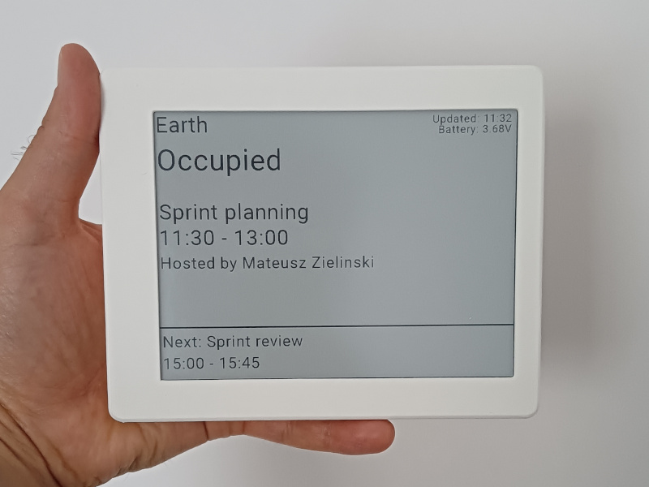
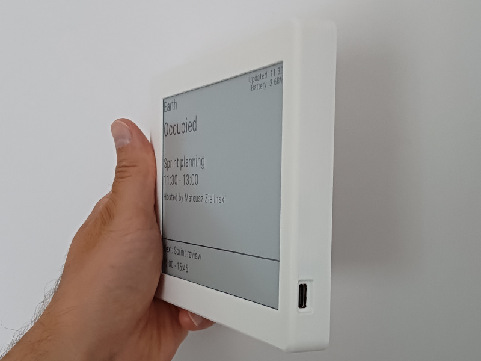

# E-ink meeting room schedule display

 

This repository contains instructions for creating a wireless e-ink device displaying schedule for a selected meeting room. Thi includes the firmware source code, models for 3D printing the case and a step-by-step guide. 

After office hours the device can be turned into a photo frame featuring photos saved on a micro SD card. This makes it ideal e.g. for home office environment.


The device is based on the [Soldered Inkplate 6](https://soldered.com/product/soldered-inkplate-6-6-e-paper-board/) board that's available for ~110€. The earlier versions of Inkplate 6 (from e-radionica) are not supported.

The product uses [Roombelt](https://roombelt.com) as a backend. This is a paid product, but for private use (e.g. home office) you can request a free license from [mateusz@roombelt.com](mailto:mateusz@roombelt.com). See pricing for commercial users [here](https://roombelt.com/#pricing).

## Prerequisites

- Soldered Inkplate 6 - [available here](https://soldered.com/product/soldered-inkplate-6-6-e-paper-board/).
- 3.7V Li-ion battery with standard JST-PH-2mm connector and at least 3000mAh - [you can buy some from Soldered, too](https://soldered.com/categories/power-sources-batteries/batteries/lithium-batteries/).
- 3D printer.
- Four M2*10 screws.
- microSD card.

## Installing firmware on the Inkplate 6
The firmware is developed with [PlatformIO](https://platformio.org/). To install firmware on your device:

1. Install PlatformIO for Visual Studio code as [documented here](https://platformio.org/install/ide?install=vscode).
2. Clone the repository locally and open it in Visual Studio Code.
3. Connect Inkplate 6 to the computer with a USB cable.
4. Click the "Upload" button to install the firmware. 

## Configuring WiFi settings
WiFi configuration is read from the `config.json` file on the micro SD card. 
The card has to be formatted using the standard FAT file system.

```json
{
    "ssid": "WiFi network name",
    "password": "Wifi network password"
}
```

## Printing and assembling the case

The case is made of two parts that are assembled using four M2*10 screws:
- [Front](models/front.stl).
- [Back cover](models/cover.stl).

Print the parts in the provided orientation using any material with the following print settings:
- Supports: Yes
- Resolution: 0.2
- Infill: 20%

TODO: Assemble instruction

## License
The firware and instructions are shared under the GNU GPLv3 license. Models for 3D printer are available under CC BY-SA 4.0 license.

